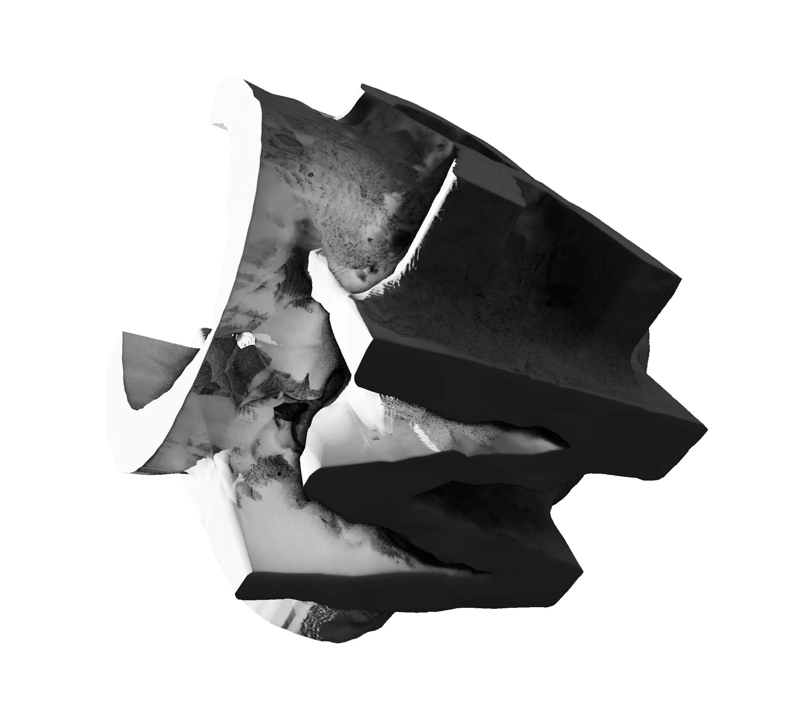
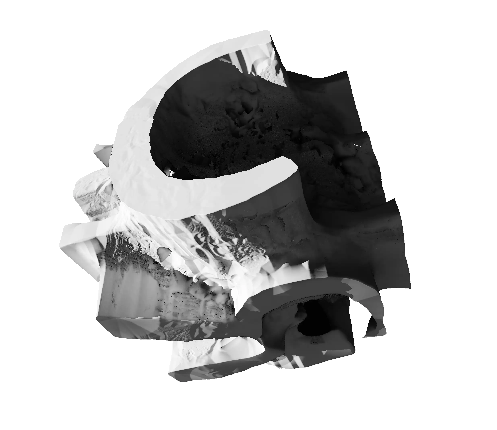

# MCRO
A C++23 templating and utilities Unreal Engine plugin, for a more civilized age.

[Read the full documentation at](https://mcro.de/mcro)

- [MCRO](#mcro)
  - [Who is this library for?](#who-is-this-library-for)
  - [Very high-level plans](#very-high-level-plans)
  - [Legal](#legal)

## Who is this library for?

MCRO (pronounced 'em-cro') is made for C++ developers who may view Unreal Engine as a C++ framework first and as a content creation tool second. It is meant to support development of other plugins, so MCRO on its own has no primary purpose, but to provide building blocks for its dependant plugins.

It also embraces quite elaborate C++ techniques involving templates and synergic combination of language features. The documentation also makes some effort explaining these techniques when used by MCRO, but the library users themselves don't need to go that deep, in order to enjoy many features of MCRO.

## Very high-level plans

* [X] Doxygen generated "nice" documentation
* [ ] Supporting common platform specific chores
  * [ ] Windows
    * [ ] Common COM / WinRT utilities
  * [ ] Linux
  * [ ] Mac
  * [ ] Android
  * [ ] iOS / TVOS / VisionOS
* [ ] Test coverage which can be taken seriously **(60%)**
* [ ] Graphics utilities
  * [ ] Shared textures but without the Unreal TextureShare library
* [ ] **'CourierPlugins'** a decentralized plugin dependency strategy compatible with FAB

## Legal
[Third-party components used by MCRO](https://mcro.de/mcro/da/dfb/Attribution.html)

When using MCRO in a plugin distributed via Fab, the components above must be listed upon submission.

In addition the following tools and .NET libraries are used for build tooling:

* [NUKE](https://nuke.build)
* [Scriban](https://github.com/scriban/scriban)
* [Humanizer](https://github.com/Humanizr/Humanizer)

And documentation:

* [Doxygen](https://www.doxygen.nl/index.html)
* [Doxygen Awesome](https://jothepro.github.io/doxygen-awesome-css/)

This library is distributed under the **Mozilla Public License Version 2.0** open-source software license. Each source code file where this license is applicable contains a comment about this.

Modifying those files or the entire library for commercial purposes is allowed but those modifications should also be published free and open-source under the same license. However files added by third-party for commercial purposes interfacing with the original files under MPL v2.0 are not affected by MPL v2.0 and therefore can have any form of copyright the third-party may choose.

Using this library in any product without modifications doesn't limit how that product may be licensed.

[Full text of the license](LICENSE)

